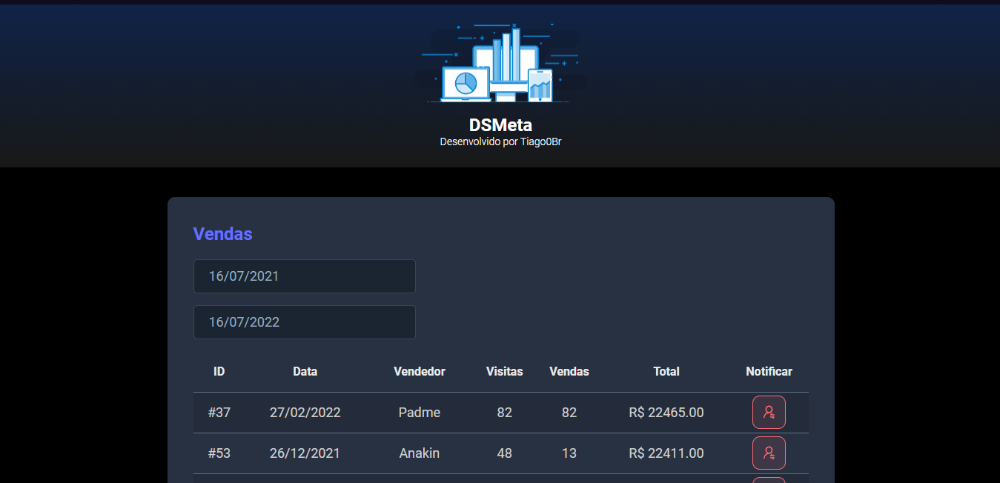

# DS Meta

## Descrição

Projeto desenvolvido no evento **Semana Spring React** ⚡ da escola [DevSuperior](https://www.youtube.com/c/DevSuperior).
O Sistema lista as vendas retornadas da API e é possível filtrá-las por data. 

Também é possível e enviar uma notificação via SMS (para o número do celular configurado numa variável de ambiente) clicando no botão da coluna "Notificar", na mensagem serão informados os dados da venda em questão.

## 🚀 Tecnologias

    

    

    

    

- [React](https://pt-br.reactjs.org) + Typescript no front-end
- Java + [Spring framework](https://spring.io) no back-end
- Banco de dados [H2](https://www.h2database.com/html/main.html)
- [Twillio](https://www.twilio.com/pt-br/) para envio de SMS
- A API foi hospedada no [Heroku](https://www.heroku.com/) e o front-end na [Netlify](https://www.netlify.com/)

## 👨🏻‍💻 Como acessar o projeto

O front-end está hospedado no Netlify e pode ser acessado por [esse link](dsmeta-tiagolopes.netlify.app).
---

Feito com 💜 &nbsp;por Tiago Lopes 👋 &nbsp;[Meu Github](https://github.com/Tiago0Br)